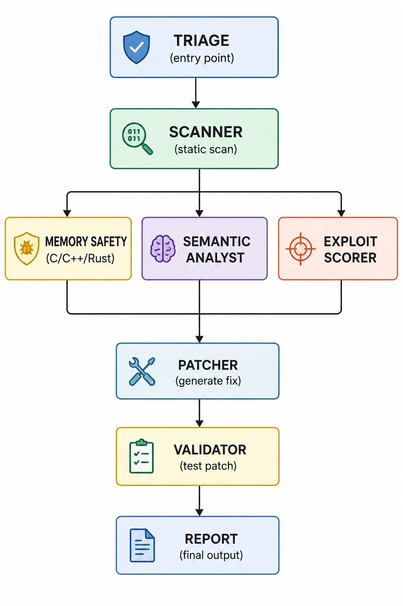

#  Multi-Agent Security

<div align="center">

**Agent IA multi-agent pour la révision de code, la détection de vulnérabilités et la correction automatique**

[](https://langchain-ai.github.io/langgraph/)
[](https://aistudio.google.com/)
[](https://www.swebench.com/)
[](LICENSE)

</div>

---

## Résumé (Abstract)

Les agents IA autonomes capables de comprendre, réviser et réparer du code en production représentent une opportunité transformatrice pour la productivité et la sécurité du génie logiciel. Les agents actuels — Devin, SWE-agent, GitHub Copilot Workspace — montrent des performances impressionnantes sur des tâches de programmation isolées mais présentent des faiblesses systématiques sur les grandes bases de code.

**Multi-Agent Security** est une architecture d'agent spécialement conçue pour la révision de code orientée sécurité et la correction automatique des vulnérabilités.
---

##  **Problématique**

L'intégration d’agents d’intelligence artificielle dans les pipelines de développement logiciel soulève aujourd’hui plusieurs questions fondamentales :

* **Fiabilité** : comment garantir des corrections justes et pertinentes ?
* **Sécurité** : comment éviter l’introduction de nouvelles vulnérabilités ?
* **Alignement architectural** : comment maintenir la cohérence globale du système logiciel ?

Les agents IA actuels rencontrent encore des difficultés lorsqu’ils doivent traiter des bases de code larges, distribuées et complexes. Plusieurs études montrent également que certains systèmes automatisés peuvent introduire de nouvelles vulnérabilités lors des corrections, avec un taux pouvant atteindre **8.7 % des cas**.

C’est dans ce contexte que s’inscrit ce projet de recherche. Notre objectif est de concevoir et d’implémenter, de bout en bout, une architecture complète de système multi-agents inspirée du fonctionnement collaboratif humain.

De la même manière qu’une équipe d’ingénieurs collabore pour analyser, corriger, vérifier et sécuriser un système logiciel, nous cherchons ici à réunir plusieurs agents spécialisés capables de travailler ensemble afin de :

* faciliter la correction automatique de code,
* améliorer la qualité des correctifs proposés,
* détecter et contrôler les vulnérabilités potentielles,
* maintenir la cohérence architecturale du projet,
* et renforcer la fiabilité globale du système.

Notre système est constitué de plusieurs agents spécialisés, chacun possédant un rôle précis dans le pipeline d’analyse, de correction et de sécurisation du code.

# **Multi-Agent Security Scanner - Architecture des 8 agents**

## **Tableau récapitulatif des agents**

| # | Agent | Rôle | LLM | Type | Séquentiel/Parallèle | Entrée | Sortie |
|---|-------|------|-----|------|---------------------|--------|--------|
| 1 | **TriageAgent** | Détecter langages et fichiers | non | Règles | Séquentiel (1er) | `repo_path` | `targets`, `detected_languages` |
| 2 | **ScannerAgent** | Scan statique (Semgrep, Bandit, etc.) | non | Outils externes | Séquentiel | `repo_path`, `languages` | `raw_findings`, `vulnerabilities` |
| 3 | **MemorySafetyAgent** | Buffer overflow, use after free, memory leak | non | Moteur Rust | **Parallèle** | `repo_root` (C/C++/Rust) | `memory_safety_findings` |
| 4 | **SemanticAnalystAgent** | Fautes logiques (IDOR, auth bypass, race conditions) | oui | LLM + RAG | **Parallèle** | `targets` (prioritaires) | `semantic_findings` |
| 5 | **ExploitScorerAgent** | Score CVSS, exploitabilité, priorité P1-P3 | Optionnel | Hybride (règles + LLM) | Séquentiel (fusion) | Toutes vulnérabilités | `cvss_score`, `is_exploitable`, `priority` |
| 6 | **PatcherAgent** | Générer correctifs automatiques | oui| LLM (strong) | Séquentiel | Vulnérabilités scorées | `patch_diff` (unified diff) |
| 7 | **ValidatorAgent** | Valider patches et vérifier régressions | non | Subprocess + Semgrep | Séquentiel | `patch_diff`, fichier | `patches_validated`, `patches_rejected` |
| 8 | **ReportAgent** | Générer rapports JSON/Markdown | non | Template | Séquentiel (final) | Toutes vulnérabilités + patches | `report` (JSON/Markdown) |

---

## **Orchestrateur central**

| Propriété | Valeur |
|-----------|--------|
| **Nom** | LangGraph (`workflow.py`) |
| **Rôle** | Centralise le flux, décide quel agent lance, gère l'état global |
| **Type** | Hybride (hiérarchique + distribué) |
| **État** | `AgentState` (objet partagé entre tous les agents) |

---

##  **Flux d'exécution**

---

<div align="center">
  
  <br>
  <em>Figure 1 : Architecture multi-agent de SecureCodeAgent</em>
</div>
---


#  **Architecture du projet MultiAgentSecurite**

Découvrez ci-joint l’architecture complète de notre projet avant de commencer à le lancer et à l’utiliser.

```
MultiAgentSecurite/
│
├── run.py                      # Point d'entrée (optionnel)
├── start.bat                   # Script démarrage Windows
├── start.sh                    # Script démarrage Linux/Mac
├── requirements.txt            # Dépendances Python
├── .env                        # Variables d'environnement (clés API)
├── .memory_cache.db            # Base SQLite (mémoire persistante)
├── .scan_cache/                # Cache des scans
│
├── env_travail/                # Environnement virtuel
│
└── src/
    │
    ├── api.py                 # API FastAPI (REST + MCP)
    ├── mcp_server.py          # Serveur MCP
    ├── github_client.py       # Client GitHub
    │
    ├── agents/                #  Agents IA
    │   ├── base.py
    │   ├── triage.py
    │   ├── scanner.py
    │   ├── memory_safety.py
    │   ├── semantic.py
    │   ├── exploit_scorer.py
    │   ├── patcher.py
    │   ├── validator.py
    │   └── report.py
    │
    ├── graph/                 #  Orchestrateur (workflow)
    │   ├── state.py
    │   ├── workflow.py
    │   └── router.py
    │
    ├── memory/               #  Mémoire persistante
    │   ├── persistent.py
    │   └── sqlite_memory.py
    │
    ├── llm/                  #  Clients LLM
    │   └── client.py
    │
    ├── tools/                #  Outils de sécurité
    │   ├── semgrep_tool.py
    │   ├── bandit_tool.py
    │   ├── gosec_tool.py
    │   ├── spotbugs_tool.py
    │   └── phpcs_tool.py
    │
    ├── rules/
    │   └── custom.yml       # Règles Semgrep personnalisées
    │
    └── static/
        └── index.html       # Interface web minimale
```

# **Lancement du projet - Explication claire**

---

## **ÉTAPE 1 : Télécharger le projet**

```bash
git clone https://github.com/hinimdoumorsia/MultiAgentSecurite.git
```
 Cette commande permet de récupérer le projet depuis GitHub sur ta machine locale.

Ensuite, place-toi dans un dossier de travail :

```bash
# Exemple : Bureau
cd C:\Users\TonNom\Desktop

# Exemple : Documents
cd C:\Users\TonNom\Documents
```

Puis entre dans le projet cloné :

```bash
cd MultiAgentSecurite
```

---

##  **ÉTAPE 2 : Créer l'environnement virtuel**

```bash
python -m venv env_travail
env_travail\Scripts\activate
```

Ici on crée un environnement isolé pour éviter les conflits de dépendances avec d'autres projets Python.

Quand tu vois `(env_travail)` dans le terminal → environnement activé.

---

## **ÉTAPE 3 : Installer les dépendances**

```bash
pip install -r requirements.txt
```

Cette commande installe toutes les bibliothèques nécessaires au projet (FastAPI, outils IA, etc.).

Attends 1 à 2 minutes selon ta connexion.

---

## **ÉTAPE 4 : Créer tes clés API**

Le projet utilise plusieurs modèles d’IA externes, donc il faut des clés API.

---

### **4.1 Groq (IA rapide)**

- Va sur https://console.groq.com  
- Crée un compte gratuit  
- Va dans **API Keys**  
- Génère une clé

Exemple de clé : `gsk_xxxxx`

---

### **4.2 NVIDIA (IA puissante)**

- Va sur https://build.nvidia.com  
- Crée un compte  
- Va dans **API Keys**  
- Génère une clé

Exemple : `nvapi-xxxxx`

---

### **4.3 GitHub Token (optionnel)**

- Va sur https://github.com/settings/tokens  
- Clique sur **Generate new token**  
- Coche `repo` + `security_events`

Ce token permet au système d’interagir avec GitHub si nécessaire.

---

## **ÉTAPE 5 : Créer le fichier `.env`**

Le fichier `.env` contient toutes les clés sensibles du projet.

Crée-le dans le dossier `src/` :

```env
GROQ_API_KEY=gsk_votre_clé_ici
NVIDIA_API_KEY=nvapi_votre_clé_ici
GITHUB_TOKEN=votre_token_ici
```

Important : ne jamais partager ce fichier publiquement.

---

##  **ÉTAPE 6 : Lancer le projet**

```bash
python -c "import sys; sys.path.insert(0, 'src'); from api import app; import uvicorn; uvicorn.run(app, host='0.0.0.0', port=8000)"
```

Cette commande démarre l’API FastAPI du projet.

---

## **Succès attendu**

Si tout fonctionne correctement, tu dois voir :

```
INFO: Uvicorn running on http://0.0.0.0:8000
INFO: Application startup complete.
```

Cela signifie que ton système multi-agents est bien lancé et prêt à être utilisé.

# **Les différents endpoints du système**

Les endpoints suivants sont exposés par notre API FastAPI afin de permettre l’interaction avec le système multi-agents.

## Endpoints API

### Informations generales

| Methode | Endpoint | Description | Exemple reponse |
|---------|----------|-------------|-----------------|
| GET | `/` | Informations generales | `{"name": "Multi-Agent Security Scanner", "version": "2.0.0", "status": "operational", "memory_backend": "SQLite"}` |
| GET | `/agents` | Liste des 8 agents | `[{"name": "triage", "description": "...", "status": "active"}]` |

---

### Scan local

| Methode | Endpoint | Description | Body / Param | Reponse |
|---------|----------|-------------|--------------|---------|
| POST | `/scan/local` | Scanner un depot local | `{"repo_path": "C:/mon-projet", "max_iterations": 3}` | `{"scan_id": "xxx", "status": "started"}` |
| GET | `/scan/local/{scan_id}` | Statut du scan | `scan_id` (path) | `{"status": "completed", "vulnerabilities_count": 4}` |
| GET | `/scan/local/{scan_id}/vulnerabilities` | Liste des vulnerabilites | `scan_id` (path) | `{"total": 4, "vulnerabilities": [...]}` |

---

### Scan GitHub

| Methode | Endpoint | Description | Body | Reponse |
|---------|----------|-------------|------|---------|
| POST | `/scan/github` | Scanner un depot GitHub distant | `{"repo_url": "https://github.com/user/repo", "branch": "main", "max_iterations": 3}` | `{"scan_id": "xxx", "status": "started"}` |
| GET | `/scan/github/{scan_id}` | Statut du scan | `scan_id` (path) | `{"status": "completed", "vulnerabilities_count": 4}` |
| GET | `/scan/github/{scan_id}/vulnerabilities` | Liste des vulnerabilites | `scan_id` (path) | `{"total": 4, "vulnerabilities": [...]}` |

---

### Utilisateurs

| Methode | Endpoint | Description | Body | Reponse |
|---------|----------|-------------|------|---------|
| POST | `/user/register` | Creer un utilisateur | `{"user_id": "alice123", "username": "Alice"}` | `{"status": "success", "user": {...}}` |
| POST | `/user/{user_id}/scan` | Scanner GitHub pour un user | `{"repo_url": "...", "branch": "main"}` | `{"scan_id": "xxx", "status": "started"}` |
| POST | `/user/{user_id}/scan/local` | Scanner local pour un user | `{"repo_path": "C:/projet"}` | `{"scan_id": "xxx", "status": "started"}` |
| GET | `/user/{user_id}/history` | Historique des scans | `user_id` (path) | `{"total_scans": 5, "history": [...]}` |
| GET | `/user/{user_id}/projects` | Projets scannes | `user_id` (path) | `{"total_projects": 3, "projects": [...]}` |

---

### Memoire persistante

| Methode | Endpoint | Description | Body | Reponse |
|---------|----------|-------------|------|---------|
| POST | `/memory/test` | Tester la memoire | `{"pattern": "...", "code_snippet": "...", "action": "store"}` | `{"status": "success", "action": "store"}` |
| GET | `/memory/stats` | Statistiques memoire | — | `{"status": "enabled", "backend": "SQLite", "patterns_count": 5}` |

---

## Exemples d'utilisation

### 1. Scanner un depot GitHub

```bash
curl -X POST "http://localhost:8000/scan/github" \
  -H "Content-Type: application/json" \
  -d '{
    "repo_url": "https://github.com/hinimdoumorsia/tkimage_studio",
    "branch": "main",
    "max_iterations": 3
  }'
```

Reponse :

```json
{
  "scan_id": "f1180e4d",
  "status": "started",
  "repo_url": "https://github.com/hinimdoumorsia/tkimage_studio",
  "message": "Scan started..."
}
```

---

### 2. Verifier le statut

```bash
curl -X GET "http://localhost:8000/scan/github/f1180e4d"
```

Reponse (en cours) :

```json
{
  "scan_id": "f1180e4d",
  "status": "running",
  "repo_url": "https://github.com/hinimdoumorsia/tkimage_studio",
  "started_at": "2026-05-28T20:19:32.513403"
}
```

Reponse (termine) :

```json
{
  "scan_id": "f1180e4d",
  "status": "completed",
  "repo_url": "https://github.com/hinimdoumorsia/tkimage_studio",
  "vulnerabilities_count": 4,
  "completed_at": "2026-05-28T20:19:39.153383"
}
```

---

### 3. Recuperer les vulnerabilites

```bash
curl -X GET "http://localhost:8000/scan/github/f1180e4d/vulnerabilities"
```

Reponse :

```json
{
  "scan_id": "f1180e4d",
  "repo_url": "https://github.com/hinimdoumorsia/tkimage_studio",
  "total": 4,
  "vulnerabilities": [
    {
      "id": "693f89b3-a013-4765-87be-dd5c5add7a1c",
      "title": "Detected a dynamic value being used with urllib",
      "severity": "medium",
      "cwe_id": "CWE-939",
      "file_path": "src/ui/right_panel.py",
      "line_start": 227,
      "description": "urllib supports 'file://' schemes, so a dynamic value controlled by a malicious actor may allow them to read arbitrary files.",
      "cvss_score": 5,
      "is_exploitable": false
    }
  ]
}
```


## Participants

| Nom | Statut | Contributions |
|---|---|---|
| **Hinimdou Morsia Guitdam** | Élève ingénieur en IA & Technologie des Données | Architecture, développement, évaluation |
| **DJERI-ALASSANI OUBENOUPOU** | Élève ingénieur en IA & Technologie des Données | Documentation, analyse des résultats |
| **Chaibou Saidou Abdoulaye** | Élève ingénieur en IA & Technologie des Données | Support technique, validation des expérimentations |

---
