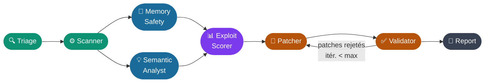
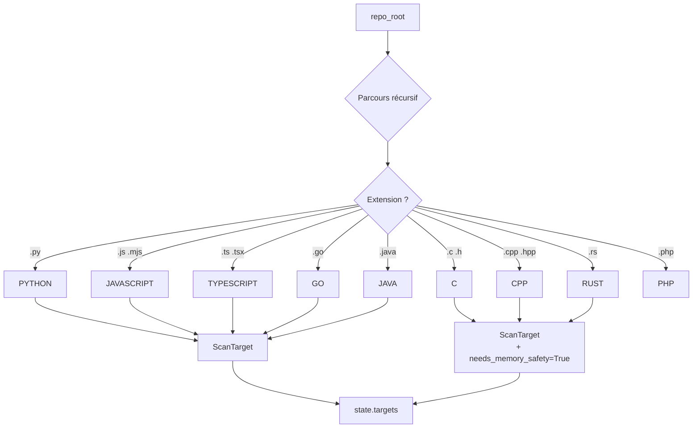
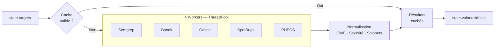
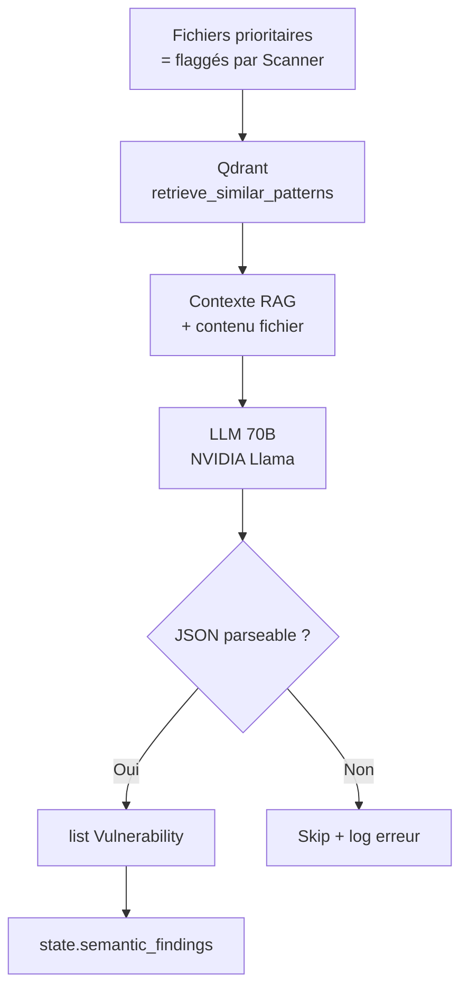
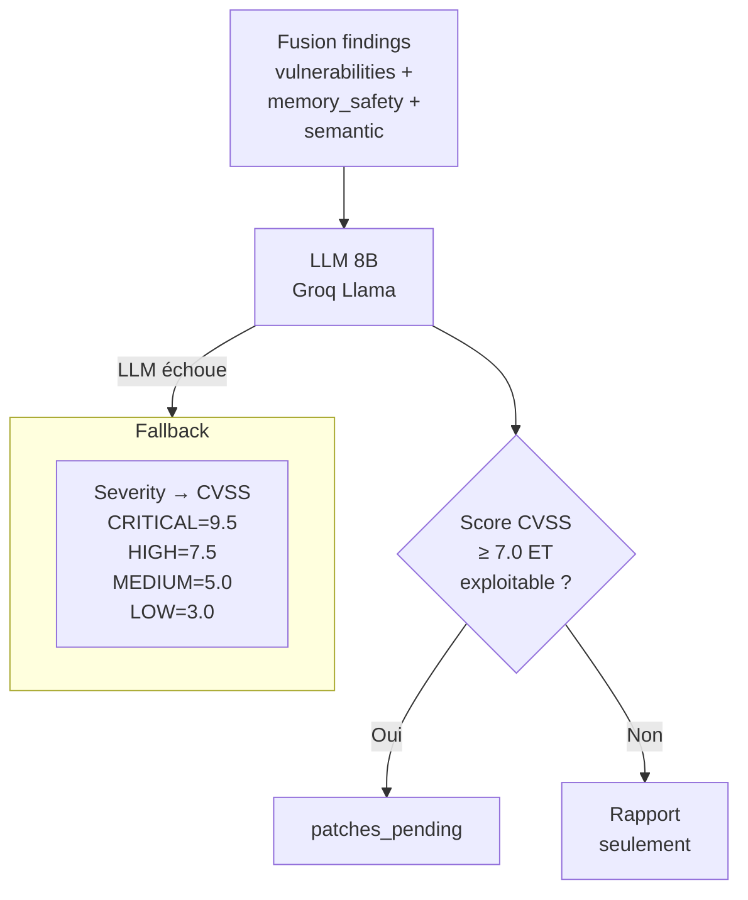
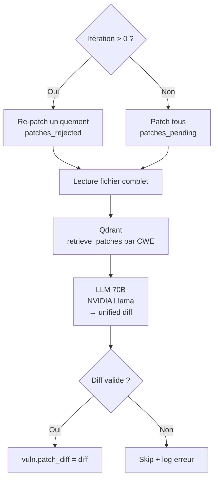
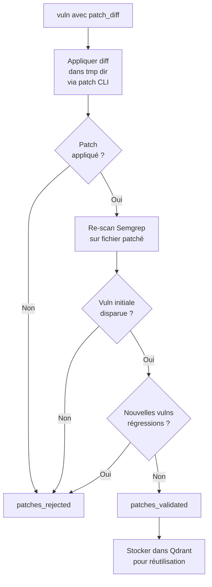

## Pipeline des agents



<CardGroup cols={2}>
  <Card title="1. Triage" icon="filter">
    Détection des langages et construction des `ScanTarget[]`
  </Card>
  <Card title="2. Scanner" icon="magnifying-glass">
    Analyse statique multi-outil avec cache intelligent
  </Card>
  <Card title="3. MemorySafety" icon="memory">
    Vulnérabilités mémoire via binaire Rust externe
  </Card>
  <Card title="4. SemanticAnalyst" icon="brain">
    Failles logiques via LLM 70B + RAG Qdrant
  </Card>
  <Card title="5. ExploitScorer" icon="chart-bar">
    Scoring CVSS 3.1 et exploitabilité via LLM 8B
  </Card>
  <Card title="6. Patcher" icon="wrench">
    Génération de unified diffs via LLM 70B
  </Card>
  <Card title="7. Validator" icon="circle-check">
    Application patch + re-scan + détection régressions
  </Card>
  <Card title="8. Report" icon="file-lines">
    Agrégation, tri et sérialisation du rapport JSON final
  </Card>
</CardGroup>

Tous les agents héritent de `BaseAgent` (`src/agents/base.py`) et implémentent `_execute(state) → state`.

---

## 1. TriageAgent

**Fichier :** `src/agents/triage.py`

**Rôle :** Premier agent du pipeline. Parcourt le dépôt, détecte les langages et prépare les cibles de scan.

**Algorithme :**

1. Récursion sur `repo_root` (exclusions : `.git`, `node_modules`, `__pycache__`, `target`, `build`, `dist`)
2. Match extension → `Language` enum
3. Lecture du contenu + calcul SHA-256
4. Construction d'un `ScanTarget` par fichier
5. Détection si C/C++/Rust → `state.needs_memory_safety = True`



**Entrée :** `state.repo_root`

**Sortie :**
- `state.targets` — liste de `ScanTarget`
- `state.detected_languages` — ensemble de `Language`
- `state.needs_memory_safety` — booléen

---

## 2. ScannerAgent

**Fichier :** `src/agents/scanner.py` (classe interne `EnhancedScanner`)

**Rôle :** Analyse statique multi-outil parallélisée avec cache intelligent.



**Outils lancés en parallèle (4 workers) :**

| Outil | Langages cibles |
|-------|----------------|
| Semgrep | C, C++, Python, JS, TS, Rust, Java, Go |
| Bandit | Python uniquement |
| Gosec | Go uniquement |
| SpotBugs | Java uniquement |
| PHPCS | PHP uniquement |

**Entrée :** `state.targets`, `state.repo_root`

**Sortie :**
- `state.vulnerabilities` — `list[Vulnerability]`
- `state.raw_findings` — résultats bruts JSON des outils

---

## 3. MemorySafetyAgent

**Fichier :** `src/agents/memory_safety.py` · **Engine :** `memory-engine/` (Rust)

**Rôle :** Détection approfondie des vulnérabilités mémoire via un moteur d'analyse statique écrit en Rust — 20 règles couvrant buffer overflow, use-after-free, double-free, format string, null pointer, et unsafe Rust.

### Construire l'engine

<Tabs>
  <Tab title="Linux / macOS">
    ```bash
    cd memory-engine
    cargo build --release
    # Binary → memory-engine/target/release/memory-engine
    ```
  </Tab>
  <Tab title="Windows (PowerShell)">
    ```powershell
    cd memory-engine
    .\build.ps1
    # Binary → memory-engine\target\release\memory-engine.exe
    ```
  </Tab>
</Tabs>

### Règles intégrées

| ID | CWE | Sévérité | Langage | Détecte |
|----|-----|----------|---------|---------|
| MEM-001 | CWE-121 | Critical | C/C++ | `strcpy()` — stack overflow |
| MEM-002 | CWE-120 | Critical | C/C++ | `strcat()` — buffer overflow |
| MEM-003 | CWE-242 | Critical | C/C++ | `gets()` — unbounded input |
| MEM-004 | CWE-134 | High | C/C++ | `sprintf()` — format overflow |
| MEM-005 | CWE-121 | High | C/C++ | `scanf("%s")` — no length limit |
| MEM-010 | CWE-416 | Critical | C/C++ | `free()` — use-after-free |
| MEM-011 | CWE-415 | Critical | C/C++ | Double-free |
| MEM-020 | CWE-252 | High | C/C++ | `malloc` result non vérifié |
| MEM-030 | CWE-476 | High | C/C++ | Null pointer dereference |
| MEM-040 | CWE-190 | High | C/C++ | Integer overflow dans `malloc(n*m)` |
| MEM-050 | CWE-134 | Critical | C/C++ | Format string non contrôlée |
| MEM-060 | CWE-770 | Medium | C/C++ | VLA — stack overflow |
| MEM-070 | CWE-119 | High | Rust | `unsafe {}` block |
| MEM-071 | CWE-843 | High | Rust | `mem::transmute` |
| MEM-072 | CWE-125 | High | Rust | `ptr::read/write/copy` |
| MEM-073 | CWE-416 | High | Rust | `Box::from_raw` |
| MEM-074 | CWE-125 | High | Rust | `slice::from_raw_parts` |
| MEM-080 | CWE-401 | Medium | C++ | `delete[]` mismatch |
| MEM-081 | CWE-119 | Medium | C/C++ | `memcpy` buffers chevauchants |

### Sortie JSON (consommée par le Python agent)

```json
{
  "findings": [
    {
      "id": "550e8400-e29b-41d4-a716-446655440000",
      "title": "Use of unsafe strcpy — stack buffer overflow risk",
      "severity": "critical",
      "cwe": "CWE-121",
      "file": "src/auth.c",
      "line_start": 42,
      "line_end": 42,
      "snippet": "  41 |   char buf[64];\n>  42 |   strcpy(buf, user_input);\n  43 |   return buf;",
      "description": "strcpy does not check destination buffer size...",
      "rule_id": "MEM-001"
    }
  ],
  "stats": {
    "files_scanned": 12,
    "total_findings": 3,
    "by_severity": { "critical": 2, "high": 1, "medium": 0, "low": 0, "info": 0 }
  }
}
```

**S'exécute uniquement si :** `state.needs_memory_safety = True` (C, C++ ou Rust détecté)

**Entrée :** `state.repo_root`, `state.needs_memory_safety`

**Sortie :** `state.memory_safety_findings`

<Note>
  Si le binaire est absent, l'agent log un warning avec la commande de build et retourne l'état inchangé. Le workflow continue normalement.
</Note>

---

## 4. SemanticAnalystAgent

**Fichier :** `src/agents/semantic.py`

**Rôle :** Détection des failles logiques non détectables par analyse statique, via LLM 70B augmenté de RAG Qdrant.



**Types de vulnérabilités ciblées :**

- Logic vulnerabilities (auth bypass, IDOR, business logic flaws)
- Injection flaws (SQL, command, LDAP, XPath, template injection)
- Cryptographic weaknesses
- Insecure deserialization
- Race conditions (TOCTOU)
- Information disclosure

**Modèle LLM :** Strong (NVIDIA Llama-3.1-70B)

**Entrée :** `state.targets`, `state.vulnerabilities` (pour priorisation)

**Sortie :** `state.semantic_findings`

---

## 5. ExploitScorerAgent

**Fichier :** `src/agents/exploit_scorer.py`

**Rôle :** Attribuer un score CVSS 3.1 et un booléen d'exploitabilité à chaque vulnérabilité.



**Modèle LLM :** Fast (Groq Llama-3.1-8B)

**Entrée :** Tous les findings fusionnés

**Sortie :**
- Mise à jour `cvss_score`, `is_exploitable`, `exploitability_score` sur chaque `Vulnerability`
- `state.patches_pending`

---

## 6. PatcherAgent

**Fichier :** `src/agents/patcher.py`

**Rôle :** Générer un unified diff pour corriger chaque vulnérabilité exploitable.



**Contraintes du system prompt :**
- Fix uniquement la vulnérabilité concernée (pas de refactoring)
- Préserver le style et l'indentation existants
- Memory safety : préférer `strncpy`, `snprintf` à `strcpy`, `sprintf`
- N'introduit pas de nouvelles vulnérabilités
- Output : unified diff **uniquement**

**Modèle LLM :** Strong (NVIDIA Llama-3.1-70B)

---

## 7. ValidatorAgent

**Fichier :** `src/agents/validator.py`

**Rôle :** Appliquer chaque patch, vérifier que la vulnérabilité a disparu et qu'aucune régression n'est introduite.



**Entrée :** Vulnérabilités avec `patch_diff` rempli

**Sortie :**
- `state.patches_validated`
- `state.patches_rejected`
- Qdrant : nouveaux patches indexés

---

## 8. ReportAgent

**Fichier :** `src/agents/report.py`

**Rôle :** Agréger, trier et sérialiser le rapport final.

**Flux :**

1. Fusion de toutes les vulnérabilités (déduplication par `id`)
2. Tri par sévérité + `cvss_score` décroissant
3. Calcul des statistiques : total, exploitables, répartition sévérité, top 5 CWEs
4. Sérialisation JSON → `state.report`

---

## Tableau récapitulatif

| # | Agent | LLM | Parallèle | Optionnel |
|---|-------|-----|-----------|-----------|
| 1 | TriageAgent | Non | Non | Non |
| 2 | ScannerAgent | Non | 4 workers internes | Non |
| 3 | MemorySafetyAgent | Non | Oui (avec Semantic) | **Oui** (binaire Rust) |
| 4 | SemanticAnalystAgent | 70B | Oui (avec MemorySafety) | Non |
| 5 | ExploitScorerAgent | 8B | Non | Non |
| 6 | PatcherAgent | 70B | Non | Non |
| 7 | ValidatorAgent | Non | Non | Non |
| 8 | ReportAgent | Non | Non | Non |

---

## Agent non branché : EnricherAgent

<Warning>
  `src/agents/enricher.py` existe dans le code mais n'est pas enregistré dans `build_workflow()`. Il ajoute des métadonnées IA supplémentaires mais reste inactif dans la version actuelle.
</Warning>
