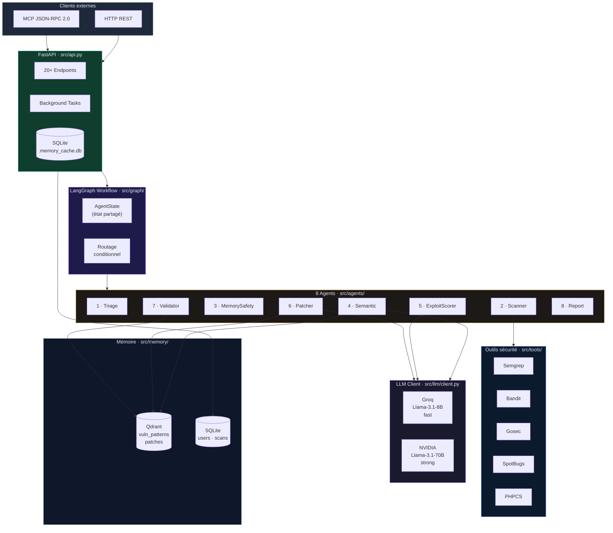
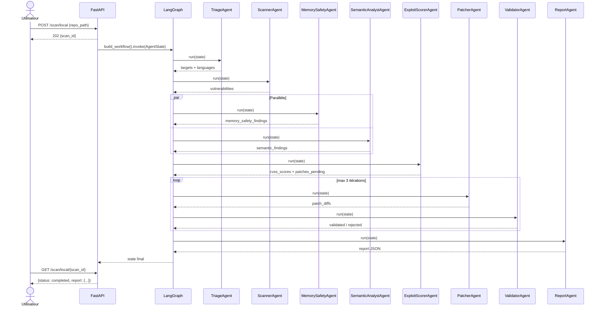
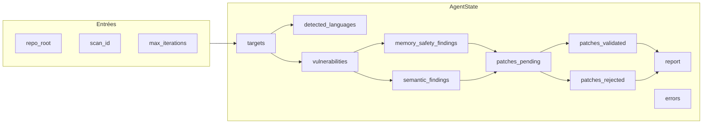
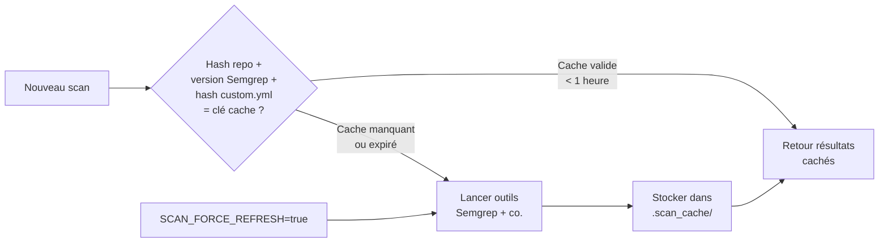

## Diagramme d'architecture globale

---

## Blocs principaux

<CardGroup cols={2}>
  <Card title="FastAPI" icon="server">
    Point d'entrée HTTP. Orchestre les scans en arrière-plan, persiste les utilisateurs et historiques dans SQLite, expose 20+ endpoints REST.
  </Card>
  <Card title="LangGraph" icon="diagram-project">
    Graphe d'exécution des agents. Gère le routage conditionnel, la parallélisation et les boucles de retry de patching.
  </Card>
  <Card title="8 Agents" icon="robot">
    Pipeline Triage → Scanner → (MemorySafety ∥ Semantic) → ExploitScorer → Patcher → Validator → Report.
  </Card>
  <Card title="Outils sécurité" icon="shield-check">
    Semgrep (multi-langage), Bandit (Python), Gosec (Go), SpotBugs (Java), PHPCS (PHP) lancés en parallèle.
  </Card>
  <Card title="LLM Client" icon="microchip">
    Deux modèles : 8B pour les tâches rapides (scoring), 70B pour les tâches profondes (analyse sémantique, patching).
  </Card>
  <Card title="Mémoire" icon="database">
    Qdrant pour les patterns de vulnérabilités et patches validés. SQLite pour les utilisateurs, projets et historique.
  </Card>
  <Card title="GitHub Client" icon="code-branch">
    Clone les dépôts (depth=1), liste les branches, nettoie les répertoires temporaires après scan.
  </Card>
  <Card title="MCP Server" icon="plug">
    Interface JSON-RPC 2.0 alternative à l'API REST, compatible clients MCP et assistants IA.
  </Card>
</CardGroup>

---

## Flux de données global

---

## Flux de données — état partagé

---

## Parallélisation

| Étape | Agents | Mode |
|-------|--------|------|
| Scan outils | Semgrep + Bandit + Gosec + SpotBugs + PHPCS | 4 workers ThreadPool |
| Enrichissement | MemorySafetyAgent + SemanticAnalystAgent | Parallel LangGraph |
| Patching/Validation | PatcherAgent + ValidatorAgent | Séquentiel + retry loop |

---

## Cache

**Répertoire :** `src/.scan_cache/` · **TTL :** 1 heure

---

## Points d'attention

<Warning>
  Le moteur de sécurité mémoire (`MemorySafetyAgent`) nécessite un binaire Rust externe compilé séparément. Sans lui, l'agent est ignoré silencieusement.
</Warning>

<Info>
  Qdrant est **optionnel**. Si le service n'est pas disponible, `SemanticAnalystAgent` et `PatcherAgent` fonctionnent sans RAG — la qualité de l'analyse diminue légèrement mais aucune erreur fatale n'est levée.
</Info>

<Tip>
  Sur un dépôt volumineux, le premier scan peut prendre 2–5 minutes. Les scans suivants (mêmes fichiers) exploitent le cache et s'exécutent en quelques secondes.
</Tip>
