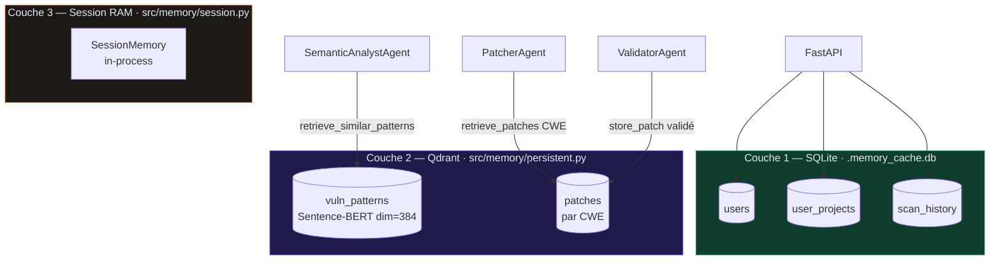
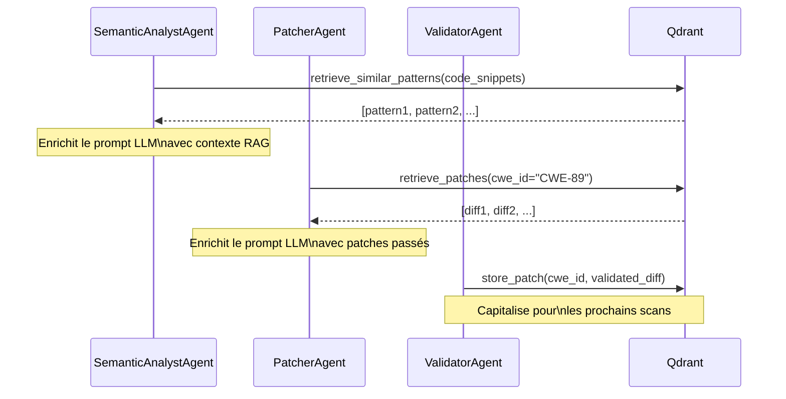

## Architecture mémoire



---

## Couche 1 — SQLite

**Fichier :** `.memory_cache.db` (créé automatiquement au démarrage de l'API)

**Fonction d'initialisation :** `init_user_db()` dans `src/api.py`

### Schéma

<Tabs>
  <Tab title="users">
    ```sql
    CREATE TABLE users (
        user_id   TEXT PRIMARY KEY,
        username  TEXT UNIQUE NOT NULL,
        created_at TIMESTAMP DEFAULT CURRENT_TIMESTAMP
    );
    ```
  </Tab>
  <Tab title="user_projects">
    ```sql
    CREATE TABLE user_projects (
        id                  INTEGER PRIMARY KEY AUTOINCREMENT,
        user_id             TEXT NOT NULL,
        repo_url            TEXT NOT NULL,
        repo_name           TEXT,
        last_scan           TIMESTAMP,
        vulnerabilities_count INTEGER DEFAULT 0,
        status              TEXT DEFAULT 'pending',
        UNIQUE(user_id, repo_url)
    );
    ```
  </Tab>
  <Tab title="scan_history">
    ```sql
    CREATE TABLE scan_history (
        scan_id              TEXT PRIMARY KEY,
        user_id              TEXT NOT NULL,
        repo_url             TEXT,
        repo_name            TEXT,
        scan_type            TEXT DEFAULT 'github',
        started_at           TIMESTAMP,
        completed_at         TIMESTAMP,
        vulnerabilities_count INTEGER,
        vulnerabilities      TEXT,   -- JSON sérialisé
        report               TEXT,   -- JSON sérialisé
        status               TEXT    -- 'running' | 'completed' | 'failed'
    );
    ```
  </Tab>
</Tabs>

### Opérations disponibles (via API)

```python
# Créer un utilisateur
POST /user/register  → {"user_id": "u1", "username": "alice"}

# Récupérer l'historique
GET /user/u1/history  → list[scan_history row]

# Récupérer les projets
GET /user/u1/projects → list[user_projects row]
```

---

## Couche 2 — Qdrant (Vector Store)

**Fichier :** `src/memory/persistent.py`

**Classe :** `PersistentMemory`

**Modèle d'embedding :** `all-MiniLM-L6-v2` (Sentence Transformers, dimension 384)

### Collections

| Collection | Contenu | Utilisé par |
|-----------|---------|-------------|
| `vuln_patterns` | Descriptions + snippets de vulnérabilités indexés | SemanticAnalystAgent |
| `patches` | Diffs unifiés validés, indexés par CWE | PatcherAgent, ValidatorAgent |

### Interface Python

```python
memory = PersistentMemory()

# Récupérer des patterns similaires au code analysé
patterns = memory.retrieve_similar_patterns(
    code_snippets=["def login(user, pwd): query = f'SELECT * FROM users WHERE pwd={pwd}'"]
)
# → ["Pattern: SQL Injection via f-string interpolation", ...]

# Récupérer des patches passés pour un CWE donné
patches = memory.retrieve_patches(cwe_id="CWE-89")
# → ["--- a/auth.py\n+++ b/auth.py\n@@ ... @@\n-...\n+...", ...]

# Stocker un nouveau pattern
memory.store_pattern(
    description="SQL Injection via f-string in login function",
    code_snippet="cursor.execute(f'SELECT * FROM users WHERE pwd={pwd}')"
)

# Stocker un patch validé
memory.store_patch(
    cwe_id="CWE-89",
    diff="--- a/auth.py\n+++ b/auth.py\n..."
)
```

### Flux de données Qdrant



### Démarrage Qdrant

```bash
# Option Docker (recommandé)
docker run -d -p 6333:6333 -p 6334:6334 \
  -v $(pwd)/qdrant_storage:/qdrant/storage \
  qdrant/qdrant

# Vérification
curl http://localhost:6333/healthz
```

<Note>
  Qdrant est **optionnel**. Si le service est indisponible, `PersistentMemory` logue un warning et toutes les méthodes retournent des listes vides. Le workflow continue sans RAG.
</Note>

---

## Couche 3 — Session Memory (RAM)

**Fichier :** `src/memory/session.py`

**Classe :** `SessionMemory`

Mémoire Python in-process, non persistée, limitée à la durée d'un run. Utilisée pour partager du contexte léger entre agents au sein d'un même scan sans passer par Qdrant.

```python
session = SessionMemory()
session.set("last_scanned_file", "src/auth.py")
session.get("last_scanned_file")  # → "src/auth.py"
```

---

## Backend SQLite alternatif

**Fichier :** `src/memory/sqlite_memory.py`

Backend SQLite pour les embeddings, utilisé comme fallback si Qdrant n'est pas disponible. Moins performant pour la recherche sémantique mais fonctionnel pour de petits volumes.

---

## Tester la mémoire

```bash
# Stocker un pattern
curl -X POST http://localhost:8000/memory/test \
  -H "Content-Type: application/json" \
  -d '{
    "pattern": "SQL Injection via f-string",
    "code_snippet": "cursor.execute(f\"SELECT * FROM users WHERE id={user_id}\")",
    "action": "store"
  }'

# Récupérer des patterns similaires
curl -X POST http://localhost:8000/memory/test \
  -H "Content-Type: application/json" \
  -d '{
    "pattern": "",
    "code_snippet": "db.execute(f\"DELETE FROM users WHERE name={name}\")",
    "action": "retrieve"
  }'

# Statistiques
curl http://localhost:8000/memory/stats
```

Réponse `/memory/stats` :

```json
{
  "qdrant_available": true,
  "collections": {
    "vuln_patterns": {"count": 142},
    "patches": {"count": 38}
  },
  "sqlite_users": 5,
  "sqlite_scans": 23
}
```
