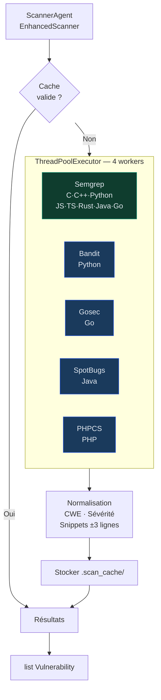

## Architecture des outils



Tous les wrappers retournent `list[dict]` normalisé, ensuite converti en `list[Vulnerability]` par `ScannerAgent`.

---

## Semgrep

**Fichier :** `src/tools/semgrep_tool.py`

**Installation :** inclus dans `requirements.txt` (`semgrep==1.163.0`)

### Rulesets par langage

| Langage | Rulesets |
|---------|----------|
| C | `p/c`, `p/default` |
| C++ | `p/cpp`, `p/default` |
| Python | `p/python`, `p/owasp-top-ten`, `p/secrets` |
| JavaScript | `p/javascript`, `p/nodejs`, `p/owasp-top-ten` |
| TypeScript | `p/typescript`, `p/nodejs`, `p/owasp-top-ten` |
| Java | `p/java`, `p/owasp-top-ten` |
| Go | `p/golang`, `p/default` |
| Rust | `p/rust` |
| PHP | `p/php` |

**Rulesets communs (tous langages) :** `p/default`, `p/owasp-top-ten`, `p/security-audit`

**Règles personnalisées :** `src/rules/custom.yml`

### Commande exécutée

```bash
semgrep --json \
  --config p/python --config p/owasp-top-ten --config p/secrets \
  --config src/rules/custom.yml \
  --severity ERROR --severity WARNING \
  /path/to/repo
```

### Format de sortie normalisé

```json
{
  "check_id": "python.django.security.audit.raw-query",
  "path": "src/auth.py",
  "start": {"line": 42},
  "end": {"line": 44},
  "extra": {
    "message": "SQL Injection via raw query",
    "severity": "ERROR",
    "metadata": {
      "cwe": ["CWE-89"],
      "owasp": ["A03:2021"],
      "cvss": 9.1
    }
  }
}
```

---

## Bandit

**Fichier :** `src/tools/bandit_tool.py`

**Langage cible :** Python uniquement

**Installation :** inclus dans `requirements.txt` (`bandit==1.9.4`)

### Commande exécutée

```bash
bandit -r /path/to/repo -f json
```

### Catégories de checks

- Injections (SQL, Shell, LDAP)
- Hardcoded credentials et secrets
- Cryptographie faible (MD5, DES, RC4)
- Assertions désactivées
- Deserialisation non sûre (pickle, yaml.load)
- Subprocess avec shell=True

---

## Gosec

**Fichier :** `src/tools/gosec_tool.py`

**Langage cible :** Go uniquement

**Installation :** Binaire externe — `go install github.com/securego/gosec/v2/cmd/gosec@latest`

### Commande exécutée

```bash
gosec -fmt json /path/to/repo/...
```

### Règles principales

| ID | Description |
|----|-------------|
| G101 | Hardcoded credentials |
| G201 | SQL query construction |
| G301 | Poor file permissions |
| G401 | Use of MD5/SHA1 |
| G501 | Import of blocklist packages |

---

## SpotBugs

**Fichier :** `src/tools/spotbugs_tool.py`

**Langage cible :** Java (analyse bytecode `.class`)

**Installation :** Binaire externe depuis [spotbugs.github.io](https://spotbugs.github.io/)

**Catégories de bugs détectés :**
- SQL Injection (SQLI)
- XSS (Servlet output)
- Path traversal (PT)
- Null pointer dereference (NP)
- Cryptographie faible (CIPHER)

---

## PHPCS

**Fichier :** `src/tools/phpcs_tool.py`

**Langage cible :** PHP uniquement

**Installation :** `composer global require squizlabs/php_codesniffer`

**Standards appliqués :** PSR-12 + règles sécurité personnalisées

---

## Règles Semgrep personnalisées

**Fichier :** `src/rules/custom.yml`

Vous pouvez ajouter vos propres règles Semgrep :

```yaml
rules:
  - id: custom-hardcoded-password
    pattern: $VAR = "password123"
    message: Hardcoded password detected
    languages: [python, javascript]
    severity: ERROR
    metadata:
      cwe: CWE-798

  - id: custom-sql-fstring
    pattern: cursor.execute(f"... {$VAR} ...")
    message: Potential SQL Injection via f-string
    languages: [python]
    severity: ERROR
    metadata:
      cwe: CWE-89
```

<Warning>
  Modifier `custom.yml` invalide automatiquement le cache. Le prochain scan relancera tous les outils depuis zéro.
</Warning>

---

## Cache intelligent

**Répertoire :** `src/.scan_cache/`

**Clé de cache :**

```python
cache_key = md5(
    repo_files_hash +        # Hash de tous les fichiers du dépôt
    semgrep_version +        # "1.163.0"
    custom_rules_hash        # Hash de custom.yml
)
```

**Comportement :**

| Situation | Cache utilisé ? |
|-----------|----------------|
| Fichiers inchangés + même version Semgrep | **Oui** |
| 1 fichier modifié | Non — re-scan complet |
| Semgrep mis à jour | Non |
| `custom.yml` modifié | Non |
| `SCAN_FORCE_REFRESH=true` | Non |

**TTL :** 1 heure (entrées expirées nettoyées au prochain scan)

---

## Normalisation des résultats

`ScannerAgent` convertit les outputs bruts en `Vulnerability` :

```python
def normalize_finding(raw: dict, tool: str) -> Vulnerability:
    return Vulnerability(
        id=str(uuid4()),
        title=raw.get("message", "Unknown"),
        severity=normalize_severity(raw.get("severity", "medium")),
        cwe_id=normalize_cwe(raw.get("cwe")),       # int → "CWE-XXX"
        file_path=raw["path"],
        line_start=raw["line_start"],
        line_end=raw["line_end"],
        code_snippet=extract_snippet(raw["path"], raw["line_start"]),  # ±3 lignes
        cvss_score=raw.get("cvss", 0.0),
        extra={"tool": tool, "raw": raw}
    )
```
