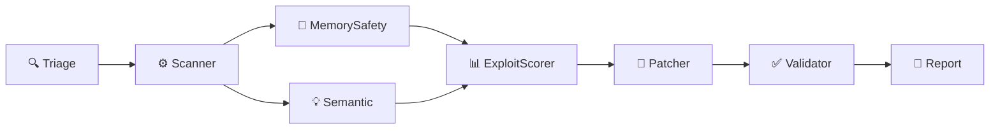

## Accès

Une fois l'API démarrée, l'interface est disponible directement sur :

```
http://localhost:8000/ui
```

Aucune installation supplémentaire — c'est un fichier HTML autonome servi par FastAPI.

---

## Vue d'ensemble

```mermaid
graph LR
    subgraph UI["Interface /ui"]
        L["Panneau gauche\nFormulaire + Historique"]
        R["Panneau droit\nRésultats"]
    end
    L -->|POST /scan/github\nPOST /scan/local| API["FastAPI"]
    API -->|polling GET /scan/{id}| R
    R -->|localStorage| H["Historique local"]
```

<Frame>
  
</Frame>

---

## Panneau gauche — Lancer un scan

### Onglet GitHub

<Steps>
  <Step title="Entrer l'URL du dépôt">
    Collez l'URL complète : `https://github.com/user/repo`
  </Step>
  <Step title="Choisir la branche">
    Par défaut `main`. Modifiez si besoin (`develop`, `master`…)
  </Step>
  <Step title="Définir les itérations de patch">
    De 1 à 5. **3 recommandé** — chaque itération re-patche les correctifs rejetés.
  </Step>
  <Step title="Lancer">
    Cliquez **Lancer le scan**. Le résultat apparaît en temps réel à droite.
  </Step>
</Steps>

### Onglet Local

Même principe avec un chemin absolu vers un dépôt local :

```
C:\Users\pc\Desktop\monprojet
/home/user/monprojet
```

### Exemples rapides

Quatre dépôts vulnérables préconfigurés — un clic pour remplir le formulaire :

| Exemple | Langage | Vulnérabilités typiques |
|---------|---------|------------------------|
| **OWASP WebGoat** | Java | SQL Injection, XSS, IDOR |
| **OWASP Juice Shop** | Node.js | Auth bypass, XXE, CSRF |
| **DVWA** | PHP | SQLi, File upload, RFI |
| **vuln-webgoat** | Python | Injection, open redirect |

---

## Panneau droit — 3 états

### 1. État initial

Écran d'accueil invitant à configurer un scan.

### 2. Scan en cours — Pipeline animé



Chaque agent affiche l'un de ces états visuels :

| Visuel | Signification |
|--------|--------------|
| 💤 Grisé | En attente |
| 🟢 Pulsant | En cours d'exécution |
| ✅ Vert | Terminé avec succès |
| 🔴 Rouge | Erreur (non bloquante) |

Un **log en temps réel** défile en bas du pipeline — horodatage, agent actif, messages d'erreur éventuels.

Le panneau se met à jour par **polling toutes les 2 secondes** sur `GET /scan/{type}/{scan_id}`.

### 3. Résultats

#### Cartes de statistiques

<CardGroup cols={5}>
  <Card title="Total" icon="list">Toutes les vulnérabilités détectées</Card>
  <Card title="Critical" icon="circle-exclamation">CVSS ≥ 9.0</Card>
  <Card title="High" icon="triangle-exclamation">CVSS 7.0–8.9</Card>
  <Card title="Medium" icon="minus">CVSS 4.0–6.9</Card>
  <Card title="Patchées" icon="circle-check">Patches validés automatiquement</Card>
</CardGroup>

#### Filtres

Filtrez la liste par sévérité ou par statut patch :

```
Toutes  |  🔴 Critical  |  🟠 High  |  🟡 Medium  |  🔵 Low  |  ✅ Patchées
```

#### Carte de vulnérabilité

Chaque vulnérabilité est affichée dans une carte expandable :

```
┌──────────────────────────────────────────────────────────┐
│ ▌ SQL Injection via f-string          CVSS 9.1  ✓ Patché │
│   📁 src/auth.py  📍 L.42  🏷 CWE-89                    ▼ │
├──────────────────────────────────────────────────────────┤
│ Description                                              │
│   strcpy does not check destination buffer size…         │
│                                                          │
│ Code concerné                                            │
│  >42 | cursor.execute(f"SELECT * WHERE id={uid}")        │
│                                                          │
│ Patch généré                                             │
│  - cursor.execute(f"SELECT * WHERE id={uid}")            │
│  + cursor.execute("SELECT * WHERE id=?", (uid,))         │
└──────────────────────────────────────────────────────────┘
```

- **Barre colorée** à gauche = sévérité
- **Badge CVSS** coloré (rouge/orange/jaune/bleu)
- **Tag patch** : ✓ Patché · ✗ Rejeté · — Non patché
- **Clic** pour expand : description + snippet + diff coloré

---

## Historique local

L'interface conserve les **8 derniers scans** dans le `localStorage` du navigateur.

Chaque entrée affiche :
- Nom du dépôt scanné
- Nombre de vulnérabilités détectées
- Date et heure
- Statut (✓ Terminé / ✗ Échoué)

<Note>
  L'historique est local au navigateur — il n'est pas synchronisé avec l'API. Pour l'historique multi-utilisateurs persistent, utilisez les endpoints [`/user/{id}/history`](/docs/api).
</Note>

---

## Architecture technique

L'interface est un **fichier HTML unique** (`src/static/index.html`) sans dépendance externe :
- CSS custom (thème dark, variables CSS)
- JavaScript vanilla (fetch, polling, localStorage)
- Servi par FastAPI via `StaticFiles` + route `/ui`

```python
# src/api.py
app.mount("/static", StaticFiles(directory="static"), name="static")

@app.get("/ui")
async def demo_ui():
    return FileResponse("static/index.html")
```

---

## Indicateur API

La topbar affiche le statut de l'API en temps réel :

| Indicateur | Signification |
|-----------|--------------|
| 🟢 **API en ligne** | `GET /` répond en < 3s |
| 🔴 **API hors ligne** | Timeout ou erreur réseau |

Vérifié toutes les **10 secondes** automatiquement.
