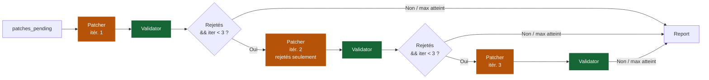
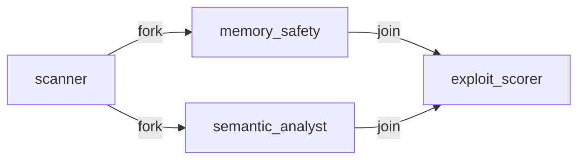
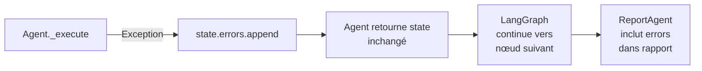

## Graphe d'exécution

```mermaid
flowchart TD
    START([▶ START]) --> TRI

    TRI["🔍 triage\nTriageAgent"]
    TRI --> RT{route_after_triage}
    RT -->|erreurs| REP
    RT -->|OK| SCN

    SCN["⚙️ scanner\nScannerAgent"]
    SCN --> RA{route_after_analysis}
    RA -->|0 findings| REP
    RA -->|findings > 0| PAR

    subgraph PAR["Parallèle"]
        direction LR
        MEM["🧠 memory_safety\nMemorySafetyAgent"]
        SEM["💡 semantic_analyst\nSemanticAnalystAgent"]
    end

    PAR --> EXP

    EXP["📊 exploit_scorer\nExploitScorerAgent"]
    EXP --> RE{route_after_exploit_scorer}
    RE -->|rien d'exploitable| REP
    RE -->|patches_pending > 0| PAT

    PAT["🔧 patcher\nPatcherAgent"]
    PAT --> RP{route_after_patcher}
    RP -->|aucun diff| REP
    RP -->|diffs générés| VAL

    VAL["✅ validator\nValidatorAgent"]
    VAL --> RV{route_after_validator}
    RV -->|rejetés && iter < max| PAT
    RV -->|OK ou max atteint| REP

    REP["📄 report\nReportAgent"]
    REP --> END([⏹ END])

    style TRI fill:#0D9373,color:#fff,stroke:none
    style SCN fill:#0D9373,color:#fff,stroke:none
    style MEM fill:#1a6b9a,color:#fff,stroke:none
    style SEM fill:#1a6b9a,color:#fff,stroke:none
    style EXP fill:#7c3aed,color:#fff,stroke:none
    style PAT fill:#b45309,color:#fff,stroke:none
    style VAL fill:#b45309,color:#fff,stroke:none
    style REP fill:#374151,color:#fff,stroke:none
    style PAR fill:#0f172a,stroke:#1a6b9a
```



---

## Nœuds enregistrés

| Nœud | Classe | Responsabilité |
|------|--------|----------------|
| `triage` | `TriageAgent` | Détection langages, construction `ScanTarget[]` |
| `scanner` | `ScannerAgent` | Analyse statique multi-outil avec cache |
| `memory_safety` | `MemorySafetyAgent` | Vulnérabilités mémoire via binaire Rust |
| `semantic_analyst` | `SemanticAnalystAgent` | Failles logiques via LLM + RAG |
| `exploit_scorer` | `ExploitScorerAgent` | Scoring CVSS 3.1 + exploitabilité |
| `patcher` | `PatcherAgent` | Génération de diffs unifiés |
| `validator` | `ValidatorAgent` | Application patch + re-scan + détection régressions |
| `report` | `ReportAgent` | Rapport JSON final |

---

## Routage conditionnel

<AccordionGroup>
  <Accordion title="route_after_triage">
    ```python
    def route_after_triage(state: AgentState) -> str:
        if state.errors:
            return "report"     # Sortie anticipée si erreur critique
        return "scanner"
    ```
  </Accordion>

  <Accordion title="route_after_analysis">
    ```python
    def route_after_analysis(state: AgentState) -> str:
        all_findings = (
            state.vulnerabilities +
            state.memory_safety_findings +
            state.semantic_findings
        )
        if not all_findings:
            return "report"     # Aucune vulnérabilité → rapport vide
        return "exploit_scorer"
    ```
  </Accordion>

  <Accordion title="route_after_exploit_scorer">
    ```python
    def route_after_exploit_scorer(state: AgentState) -> str:
        if not state.patches_pending:
            return "report"     # Rien à patcher (tout < CVSS 7.0)
        return "patcher"
    ```
    `patches_pending` = vulnérabilités avec `is_exploitable=True` ET `cvss_score >= 7.0`.
  </Accordion>

  <Accordion title="route_after_patcher">
    ```python
    def route_after_patcher(state: AgentState) -> str:
        patched = [v for v in state.patches_pending if v.patch_diff]
        if not patched:
            return "report"
        return "validator"
    ```
  </Accordion>

  <Accordion title="route_after_validator">
    ```python
    def route_after_validator(state: AgentState) -> str:
        if state.patches_rejected and state.iteration < state.max_patch_iterations:
            state.iteration += 1
            return "patcher"    # Retry avec uniquement les patches rejetés
        return "report"
    ```
  </Accordion>
</AccordionGroup>

---

## Boucle de retry (Patching)



---

## Parallélisation Memory Safety + Semantic



<Note>
  `memory_safety` n'est exécuté que si `state.needs_memory_safety = True` (langages C, C++ ou Rust détectés). Sinon, il retourne l'état inchangé immédiatement.
</Note>

---

## Construction du graphe

```python
# src/graph/workflow.py
from langgraph.graph import StateGraph, END
from src.graph.state import AgentState

def build_workflow() -> StateGraph:
    graph = StateGraph(AgentState)

    # Nœuds
    graph.add_node("triage",            TriageAgent().run)
    graph.add_node("scanner",           ScannerAgent().run)
    graph.add_node("memory_safety",     MemorySafetyAgent().run)
    graph.add_node("semantic_analyst",  SemanticAnalystAgent().run)
    graph.add_node("exploit_scorer",    ExploitScorerAgent().run)
    graph.add_node("patcher",           PatcherAgent().run)
    graph.add_node("validator",         ValidatorAgent().run)
    graph.add_node("report",            ReportAgent().run)

    # Point d'entrée
    graph.set_entry_point("triage")

    # Arêtes conditionnelles
    graph.add_conditional_edges("triage",         route_after_triage)
    graph.add_conditional_edges("scanner",        route_after_analysis)
    graph.add_conditional_edges("exploit_scorer", route_after_exploit_scorer)
    graph.add_conditional_edges("patcher",        route_after_patcher)
    graph.add_conditional_edges("validator",      route_after_validator)

    # Arêtes directes (parallèle)
    graph.add_edge("scanner",          "memory_safety")
    graph.add_edge("scanner",          "semantic_analyst")
    graph.add_edge("memory_safety",    "exploit_scorer")
    graph.add_edge("semantic_analyst", "exploit_scorer")
    graph.add_edge("report", END)

    return graph.compile()
```

---

## Gestion des erreurs dans le workflow



Chaque agent encapsule son exécution :

```python
class BaseAgent(ABC):
    def run(self, state: AgentState) -> AgentState:
        state.current_agent = self.name
        try:
            state = self._execute(state)
        except Exception as exc:
            state.errors.append(f"{self.name}: {exc}")
        return state
```

Les erreurs s'accumulent dans `state.errors[]` et sont incluses dans le rapport final. Aucune exception ne brise le workflow.
